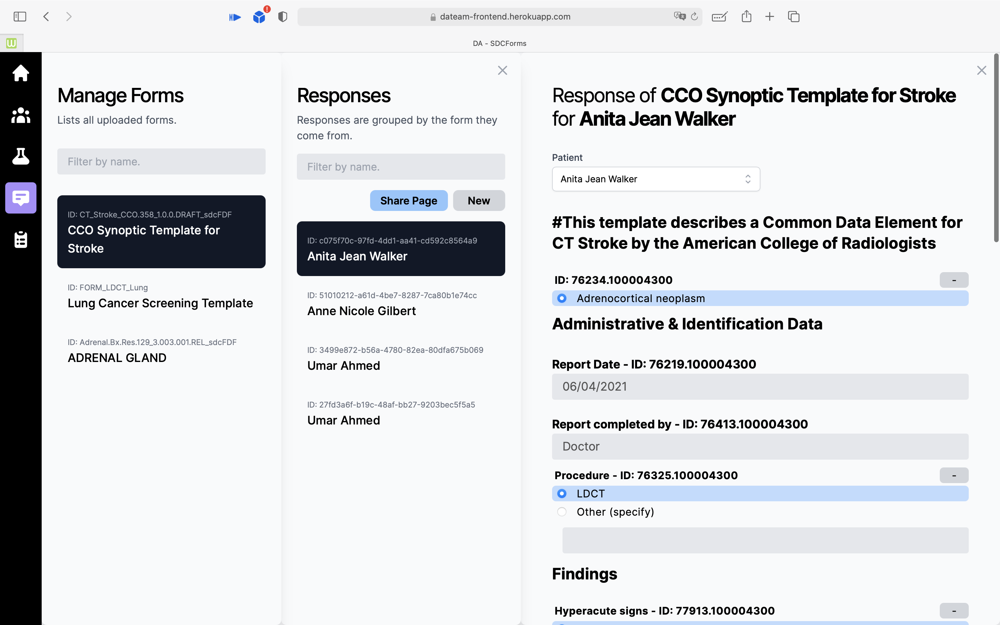
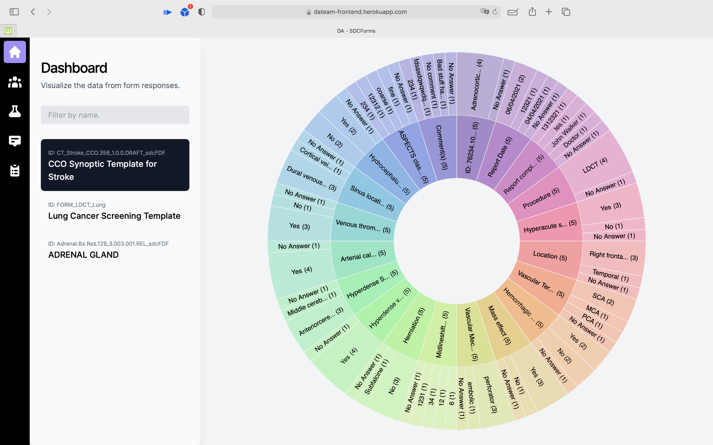

# Large Projects

## [Lumen](https://github.com/vinaykomaravolu/Lumen) (C#, Unity)

Role: Lead programmer

Lumen is a 3D platformer game developed using Unity. A game made with 4 developer, 2 artists, and a music producer

## [SDC Web App](https://github.com/csc302-spring-2021/proj-DaTeam) (TypeScript, Node, PostgreSQL)

Role: Backend lead

A platform that allows the public health employees to store, display, and fill clinical forms for easier data collection and faster data analysis during the pandemic.

# Game Projects

## [Air War X](https://otomn.itch.io/air-war-x)

Role: Programmer

Air War X is a 2-player 3D bullet hell game developed with another level designer for GDDC game jam (48 hours).

## [ProjectX](https://github.com/ProjectX18/projectX)

Role: Lead programmer, project manager

ProjectX is a Top-Down Shooter game developed by 2 programmers, 1 3D artist and 1 level designer.

## [Alchymia](https://otomn.itch.io/alchymia)

Alchymia is a 100% original (original music and original modelling) Top-Down Shooter game with a creative element combination system.

## [Glory Crest](https://otomn.itch.io/glory-crest)

Glory Crest is a 99% original (50% original music and 100% original modelling) flying simulator game. Won 3rd place in GDDC Game Making Death Match 2017.

#### View more on [itch.io](https://otomn.itch.io)

# Open-Source Projects

## [st](https://github.com/otomn/st) (Python, Shell)
A tool for storing the output of any program and select lines to be used as inputs or arguments to other programs. Greatly improves the efficiency when working with git.

## [GoogleTranslateTab](https://github.com/otomn/GoogleTranslateTab) (Swift)
Brings Google Translate API to Swift\
And a light translate tab app built using SwiftUI.

#### View more on [GitHub](https://github.com/otomn)

## Contributions

[Mozilla Firefox](https://github.com/mozilla/gecko-dev),
[you-get](https://github.com/soimort/you-get)

